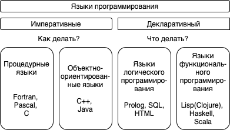

# Вступление

## Цели
***
1. Последовательное представление материала.
2. Использование простых и наглядных примеров.
3. О том, что наиболее важно для пониманя языка, а не все, что я знаю.
4. Целенаправленное изложение, чтобы время лекции и время между упражнениями было минимальным.
5. Формирование прочной основы для дальнейшего изучения более трудных книг и курсов.

## Упражнения
***
Простые упражнения полезны для понимания темы обучающимся, упражнения приводятся в конце каждой главы. Большинство 
упражнений простые, чтобы их можно было выполнить во время лекции.

## Программирование
***
Процесс создания подробных инструкций, используемых компьютерами для выполнения любой указанной задачи.

### Компетенции программиста: 
1. Умение решать задачи
2. Аналитический склад ума
3. Упорство
4. Умение работать в команде
5. Хорошая концентрация
6. Усидчивость
7. Алгоритмизированный подход
8. Ответственность
9. Коммуникабельность
10. Инициативность

Ларри Уолл, создатель `Perl`: “_Многие знакомы с достоинствами программиста. Их всего три, и, разумеется, это: лень, 
нетерпеливость и гордыня._”

## Языки программирования

